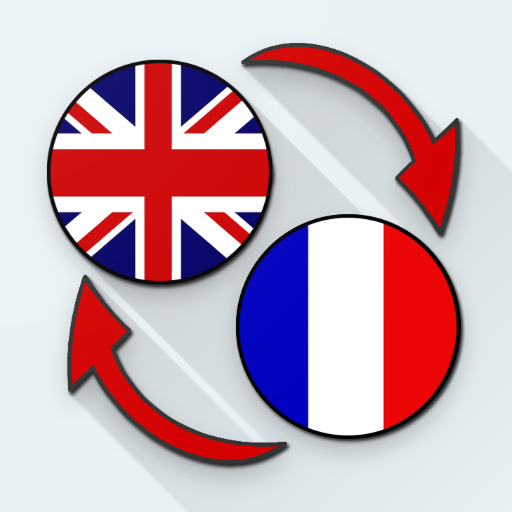

# French Translation 

A React-based app that allows users to input or upload French text and get English translations for individual words via tooltips. The translations are dynamically fetched from an API and displayed when users click on a word.

## Features ✨
- **Real-time Translation**: Click on any French word in the text to get the English translation. 💬
- **Text Input & File Upload**: Users can either type a French sentence or upload a `.txt` file containing French text. 📑
- **Tooltips for Translations**: Translations are displayed in a tooltip when users click on a word, providing a seamless translation experience. 🛠️
  
## Demo 🚀

You can view the live demo of this project on GitHub Pages here:  
[French Translation Demo](https://bradleyverrinder.github.io/frenchtranslation/)

## Technologies Used 🖥️
- **React**: Frontend framework for building the interactive UI. ⚛️
- **Radix UI**: A component library for tooltips. 🧰
- **MyMemory Translation API**: Provides the French-to-English translations. 🌐

